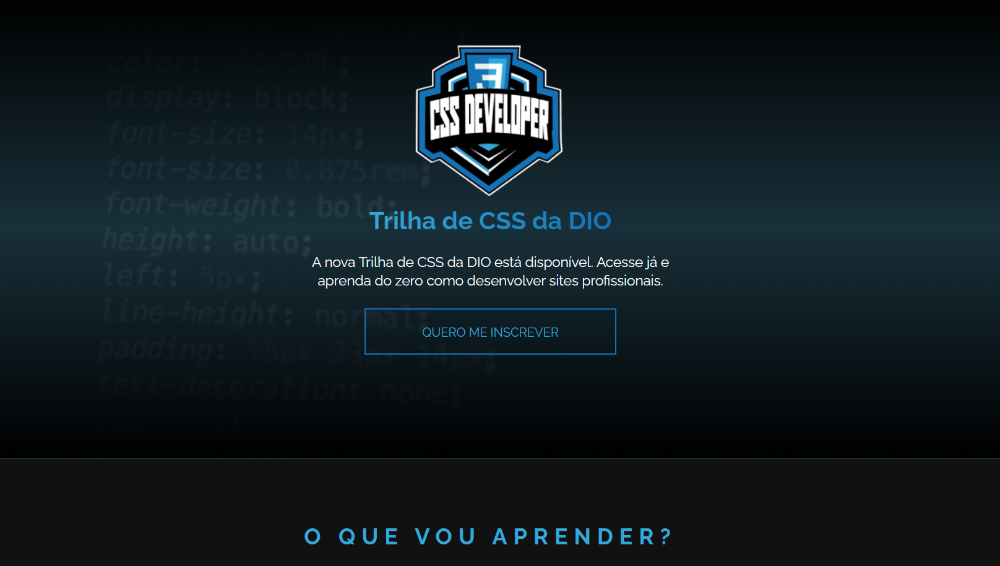

# Desafio de CSS

Este desafio CSS tem como propósito avaliar suas habilidades de estilização para desenvolver um layout moderno e cativante. O projeto compreende uma página web com diversas seções, cada uma apresentando seu estilo e funcionalidade únicos. Concentre-se especialmente na aplicação de `linear-gradient`, `box-shadow` e `text-shadow`. Encorajamos você a explorar sua criatividade, experimentando diversas combinações para alcançar um design impactante.

## Layout

Confira o layout do projeto no Figma para uma análise detalhada da estrutura visual. O ambiente interativo proporciona uma compreensão profunda da estética, organização e interações. Clique [aqui](https://dio.me/curso-css/AF8WB16042I7) para acessar e colaborar no desenvolvimento do projeto.

## Variáveis de Cores

O desafio utiliza variáveis de cores para facilitar a manutenção e personalização do esquema de cores. Aqui estão algumas das variáveis principais:

- `--primary-color`: #33a8db
- `--secondary-color`: #1472b7
- `--white-color`: #FFFFFF
- `--gray-500`: #252525
- `--background-gradient`: gradiente linear para o fundo
- `--text-gradient`: gradiente linear para o texto

## Recursos Úteis

- [MDN Web Docs - linear-gradient](https://developer.mozilla.org/en-US/docs/Web/CSS/linear-gradient)
- [MDN Web Docs - box-shadow](https://developer.mozilla.org/en-US/docs/Web/CSS/box-shadow)
- [MDN Web Docs - text-shadow](https://developer.mozilla.org/en-US/docs/Web/CSS/text-shadow)
